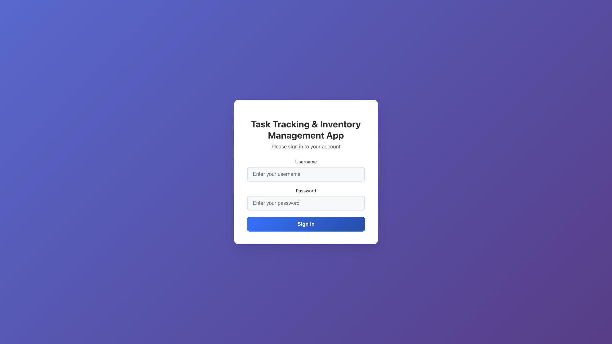
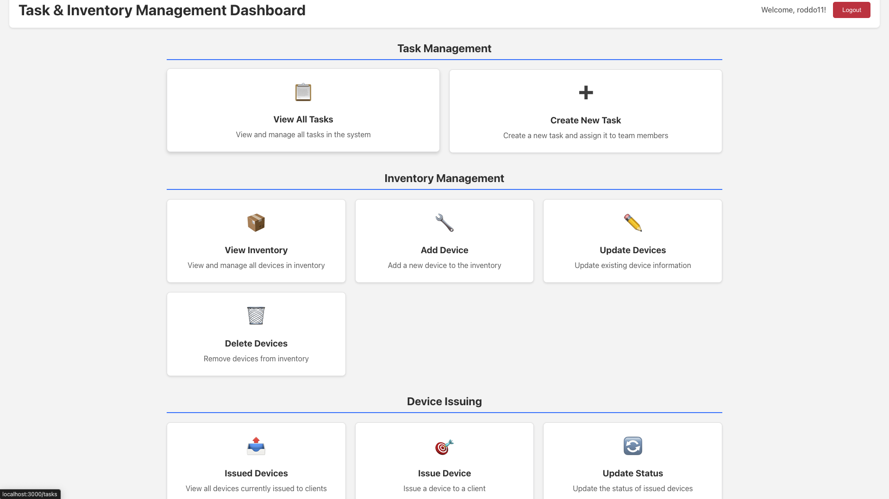
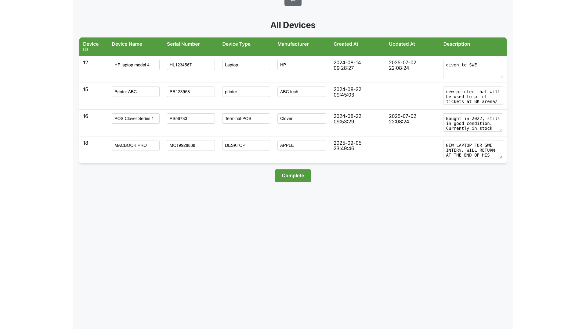
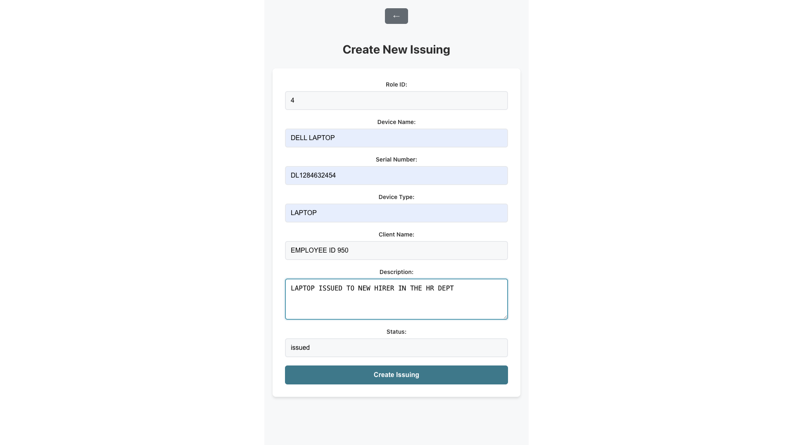
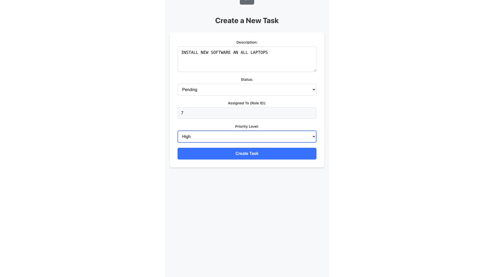
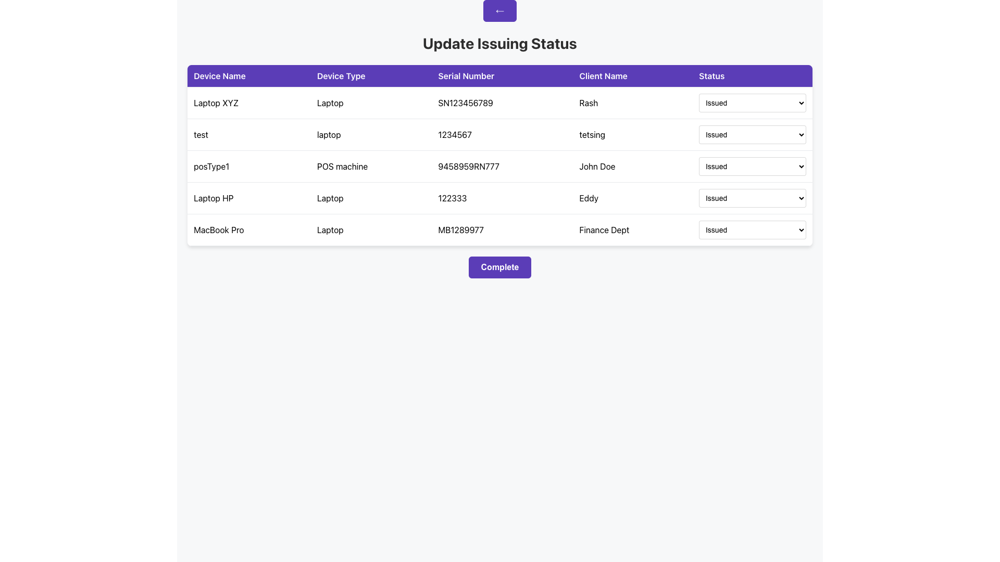
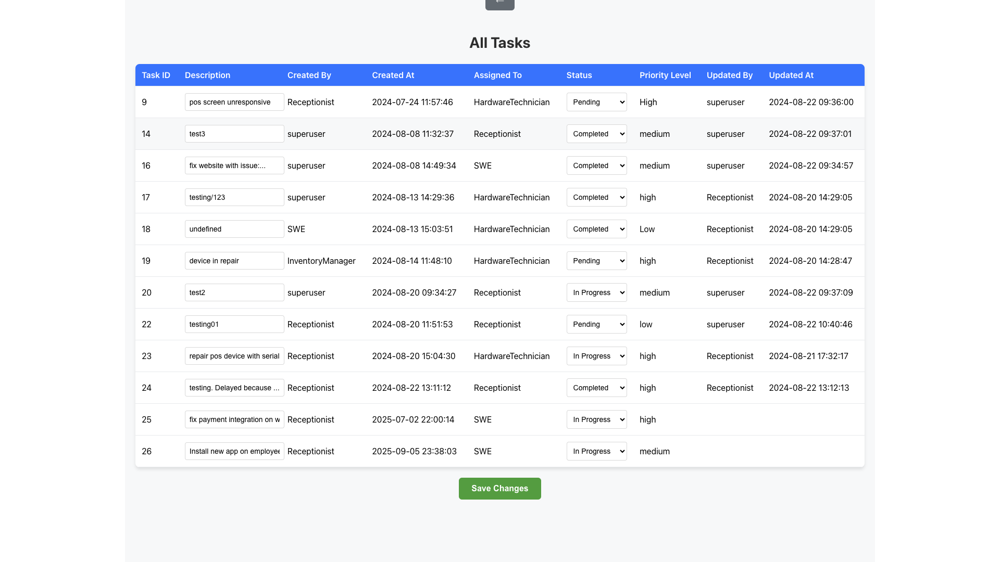
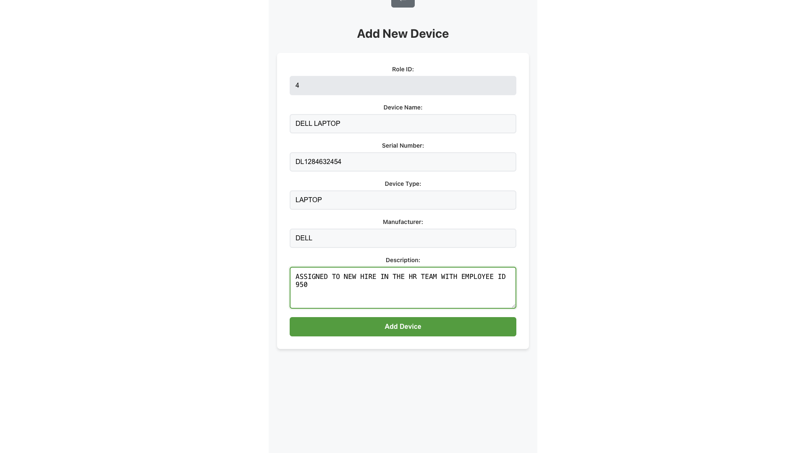

# 🗂️ Task & Inventory Management System

This is a **full-stack Task and Inventory Management System** built with **Spring Boot** and a **React.js frontend**.  
It allows users to securely manage tasks, track inventory levels (issue & update device status), and navigate through a responsive user interface.  

---

## 🚀 Live Demo
👉 [View Live Demo](https://www.loom.com/share/3952ef89da344bfb9cce6d1057fa51d3?sid=a8dd3184-c175-4609-9883-308f8fae53b7)

---

## 🛠️ Tech Stack

**Backend**
- Java + Spring Boot (IntelliJ IDEA as IDE)  
- PostgreSQL (via pgAdmin4)  
- Spring Security + JWT for authentication & RBAC  
- Insomnia for API testing  
- Git + GitHub for version control  

**Frontend**
- React.js + JavaScript (VS Code as IDE)  
- Responsive UI with:
  - Login page  
  - Dashboard  
  - Sidebar for navigation  

**Security**
- JWT-based authentication  
- Role-based access control (RBAC)  
- Spring Security for defining roles & permissions
- Password Encryption and Hashing 

---

## ✨ Key Features
✅ User Registration & Login  
✅ Secure Authentication & Authorization  
✅ Role-Based Access Control (RBAC)  
✅ Task Tracking System  
✅ Inventory Management  
✅ Device Issuing & Status Updates  
✅ Real-time Updates (e.g., status changes, user actions)  
✅ Responsive Sidebar Navigation  

---

## 🖼️ Screenshots

### 🔑 Login Page

### 📊 Dashboard

### 📦 View Inventory

### 📤 Issue a Device

### 📝 Create New Task

### 🔄 Update Issuing Status

### 📋 View All Tasks

### ➕ Add New Device

---

## 🧑‍💻 Developer Tools
- **Git & GitHub** → version control & collaboration  
- **IntelliJ IDEA** (backend) & **VS Code** (frontend) → development environments  
- **Insomnia API Client** → testing backend endpoints  
- **pgAdmin4** → database management  

---

## 📌 About
This project demonstrates full-stack development skills with secure authentication, responsive UI, and CRUD operations for task & inventory management. It’s designed for companies to track devices, tasks, and user activity efficiently.  
